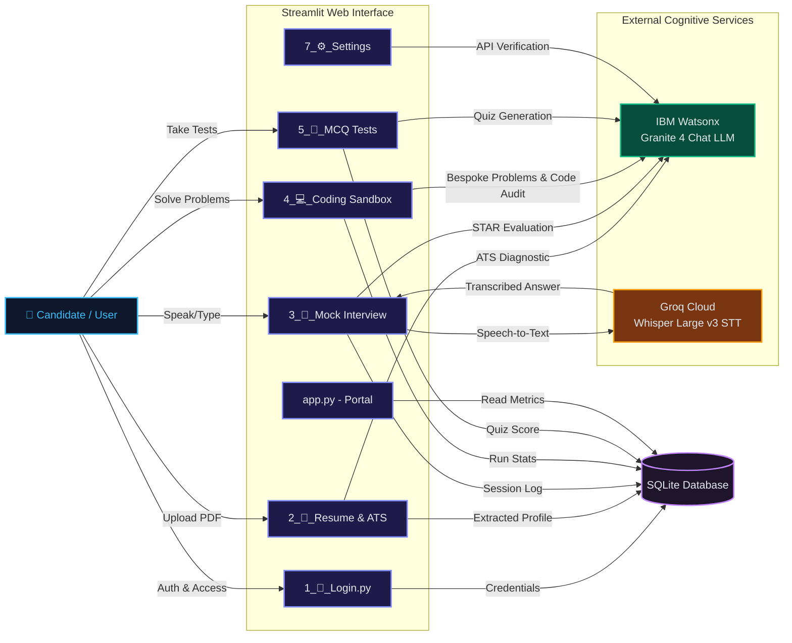

# 🎤 InterviewAI — Your Personal AI-Powered Placement Coach

<p align="center">
  
  
  
  
  
  
</p>

---

Welcome to **InterviewAI**! 🚀 A premium, feature-rich multi-page Streamlit application designed to help candidates ace placement exams, mock interviews, and technical code reviews. 🌟

InterviewAI parses your resume 📄, analyzes ATS compatibility 📊, simulates live interviews (supporting text and vocal speech-to-text answers) 🎤, generates personalized programming challenges 💻, and provides custom MCQ exams 🧠—all powered by **IBM Granite 4** and **Groq Whisper**! 🤖

---

## 🏗️ System Architecture

The following Mermaid diagram illustrates the data flow, frontend page orchestration, local database logging, and AI API integrations:



---

## 🌟 Key Features

### 📄 1. Resume Analyst & ATS Optimiser
- Extracts structured profile fields (Skills, Experience, Projects) from uploaded PDF resumes using IBM Granite.
- Calculates an interactive ATS Compatibility Score against target job descriptions.
- Provides actionable suggestions including side-by-side rewritten bullet points formatted for recruitment trackers.

### 🎤 2. Voice-Enabled Mock Interview Simulator
- Simulates real-world technical and behavioral interview conditions.
- Supports vocal voice response using Groq Whisper Speech-to-Text or typed text responses.
- Evaluates candidate answers on Technical Depth, STAR Structure, and Grammar.

### 💻 3. Coding Sandbox & AI Code Review
- Generates bespoke programming problems themed around the skills listed in your resume.
- Features a coding editor supporting Python, Java, and C++.
- Runs code diagnostics providing a completion score, asymptotic time and space complexity evaluations, and optimized solution codes.

### 🧠 4. MCQ Test Center
- **Technical Track:** Personalized exams designed to test the exact skills parsed from your resume.
- **Aptitude Track:** Questions covering Quantitative Aptitude, Logical Reasoning, and Verbal Ability (similar to campus placement exams by TCS, Infosys, Wipro, and Accenture).
- Provides instant grading with step-by-step mathematical and logical explanations.

### 📊 5. Dashboard & Downloadable Reports
- Aggregates performance history showing radar charts of skill strengths and score trends over time.
- Lets you download a detailed, professionally styled PDF report of your interview transcript using `FPDF2`.

---

## 🗄️ Database Schema & Entities

The application stores all user profiles 👤, resumes 📄, evaluations 🎤, and test results 🧠 locally in an `interview_ai.db` SQLite database 🗄️ using a relational model. Below is the schema mapping of the core database tables:

### 1. 👤 `users` Table
Stores candidate accounts with SHA256 hashed credentials 🔑.
| Column | Type | Constraints | Description |
|---|---|---|---|
| `id` | INTEGER | PRIMARY KEY AUTOINCREMENT | Unique Identifier |
| `username` | TEXT | UNIQUE | Candidate username |
| `password` | TEXT | NOT NULL | SHA256 hashed password string |
| `created_at` | TIMESTAMP | DEFAULT CURRENT_TIMESTAMP | Date of registration |

### 2. 📄 `resumes` Table
Maintains parsed candidate profiles and skills extracted from PDFs 📂.
| Column | Type | Constraints | Description |
|---|---|---|---|
| `id` | INTEGER | PRIMARY KEY AUTOINCREMENT | Unique Identifier |
| `user_id` | INTEGER | FOREIGN KEY REFERENCES users(id) | Linked candidate |
| `file_name` | TEXT | NOT NULL | PDF filename |
| `extracted_text` | TEXT | NOT NULL | Raw PDF string contents |
| `skills` | TEXT (JSON) | NOT NULL | Parsed skill list |
| `projects` | TEXT (JSON) | NOT NULL | Parsed project list |
| `experience` | TEXT (JSON) | NOT NULL | Parsed employment records |
| `uploaded_at` | TIMESTAMP | DEFAULT CURRENT_TIMESTAMP | Parsing timestamp |

### 3. 🎤 `interviews` Table
Records candidate mock interview sessions ⏱️.
| Column | Type | Constraints | Description |
|---|---|---|---|
| `id` | INTEGER | PRIMARY KEY AUTOINCREMENT | Unique Session Identifier |
| `user_id` | INTEGER | FOREIGN KEY REFERENCES users(id) | Candidate identifier |
| `type` | TEXT | NOT NULL | track name e.g., "Technical", "Behavioral" |
| `overall_score` | REAL | DEFAULT NULL | Composite score (0-10) calculated by AI |
| `strengths` | TEXT (JSON) | DEFAULT NULL | AI evaluated strength bullets |
| `weaknesses` | TEXT (JSON) | DEFAULT NULL | AI evaluated improvement bullets |
| `recommendations` | TEXT (JSON) | DEFAULT NULL | Study check-list recommendations |
| `taken_at` | TIMESTAMP | DEFAULT CURRENT_TIMESTAMP | Date of interview completion |

### 4. 📝 `interview_details` Table
Maintains question-by-question dialogue logs, transcripts, and evaluation metrics 📊.
| Column | Type | Constraints | Description |
|---|---|---|---|
| `id` | INTEGER | PRIMARY KEY AUTOINCREMENT | Unique log ID |
| `interview_id` | INTEGER | FOREIGN KEY REFERENCES interviews(id) | Linked interview session |
| `question` | TEXT | NOT NULL | Interview question |
| `user_answer` | TEXT | NOT NULL | Candidate text/voice transcription answer |
| `scores` | TEXT (JSON) | NOT NULL | Individual scores (Technical, Communication, Relevance, Grammar, STAR structure) |
| `overall_score` | REAL | NOT NULL | Average question score |
| `feedback` | TEXT | NOT NULL | Core critique points |
| `star_check` | TEXT | NOT NULL | STAR method alignment review |
| `improved_answer` | TEXT | NOT NULL | Sample polished alternative answer |

### 5. 💻 `coding_history` Table
Logs programming attempts and review metrics in the coding sandbox 💻.
| Column | Type | Constraints | Description |
|---|---|---|---|
| `id` | INTEGER | PRIMARY KEY AUTOINCREMENT | Log entry ID |
| `user_id` | INTEGER | FOREIGN KEY REFERENCES users(id) | Candidate identifier |
| `problem_name` | TEXT | NOT NULL | Coding challenge title |
| `code` | TEXT | NOT NULL | Written programming solution |
| `language` | TEXT | NOT NULL | Language used (Python, Java, C++) |
| `score` | INTEGER | NOT NULL | Completion score (0-100) |
| `feedback` | TEXT | NOT NULL | Algorithmic feedback review |
| `attempted_at` | TIMESTAMP | DEFAULT CURRENT_TIMESTAMP | Time of evaluation |

### 6. 🧠 `mcq_results` Table
Logs multiple-choice placement test outcomes 🏆.
| Column | Type | Constraints | Description |
|---|---|---|---|
| `id` | INTEGER | PRIMARY KEY AUTOINCREMENT | Quiz attempt identifier |
| `user_id` | INTEGER | FOREIGN KEY REFERENCES users(id) | Candidate identifier |
| `mode` | TEXT | NOT NULL | Track: "technical" or "aptitude" |
| `score` | INTEGER | NOT NULL | Correct question count |
| `total` | INTEGER | NOT NULL | Total questions count |
| `time_taken_sec` | INTEGER | NOT NULL | Time elapsed in seconds |
| `taken_at` | TIMESTAMP | DEFAULT CURRENT_TIMESTAMP | Test completion date |

---

## 🤖 AI Engines & Logic Flows

InterviewAI deploys dual-cognitive logic to drive responses 🧠⚡:

### 1. 🔷 IBM Watsonx AI Chat API (`ibm/granite-4-h-small`)
- **System Prompting 📝:** Prompts instruct Granite to output raw, unadorned JSON keys matching strict schemas.
- **Parsing Middleware 🧹:** `_clean_json()` extracts clean json substrings by sanitizing markdown delimiters (```json ... ```) and mapping bracket boundaries, avoiding runtime parsing failures.
- **Credential Fallbacks ⚙️:** Automatically falls back to system variables (`WATSONX_APIKEY` / `WATSONX_PROJECT_ID`) if session credentials aren't saved inside Settings.

### 2. 🟠 Groq Cloud Whisper STT API (`whisper-large-v3`)
- **Conversion Utility 🎙️:** Built-in `_convert_to_wav` sub-process converts audio input (like temporary webm/mp4 inputs) into standard 16kHz mono WAV streams using FFmpeg.
- **Transcription Routing 🔄:** Transcription outputs are passed directly as text to Watsonx's evaluation pipelines, keeping the STT execution fast and decoupled from the reasoning engine.

---

## 📁 Project Structure

```
InterviewAI-Your-Personal-AI-Powered-Placement-Coach/
├── .env.example             # Template file showing required environment variable keys
├── .gitignore               # Excludes environment configurations and databases from git
├── README.md                # Detailed project documentation and architecture flowcharts
├── app.py                   # Application home portal and sidebar state manager
├── database.py              # Local SQLite database configurations, setup, and statistics retriever
├── ai_service.py            # IBM Watsonx (Granite 4) and Groq (Whisper v3 STT) AI API wrapper
├── requirements.txt         # Production packages dependency file
├── assets/
│   └── style.css            # Custom glassmorphic dark-theme design stylesheet
└── pages/
    ├── 1_👤_Login.py          # Secure candidate registration & credentials portal
    ├── 2_📄_Resume_&_ATS.py   # Resume PDF profile parser & job description ATS matcher
    ├── 3_🎤_Mock_Interview.py # AI Placement Simulator supporting speech-to-text response
    ├── 4_💻_Coding_Sandbox.py  # Tailored data structures coding editor & complexity reviewer
    ├── 5_🧠_MCQ_Tests.py      # Customized technical track and standard placement aptitude exams
    ├── 6_📊_Dashboard.py      # Progress tracker dashboard with Plotly visualizer and PDF transcripts downloader
    └── 7_⚙️_Settings.py       # API connection manager and active service credentials diagnostics
```

---

## 🛠️ Installation & Setup

Follow these steps to run the application locally:

### 1. Clone the Repository
```bash
git clone https://github.com/dhanish0711/InterviewAI-Your-Personal-AI-Powered-Placement-Coach.git
cd InterviewAI-Your-Personal-AI-Powered-Placement-Coach
```

### 2. Install Dependencies
```bash
pip install -r requirements.txt
```

### 3. Create Environment Variables Configuration
Create a `.env` file in the root folder of the project:
```ini
# IBM Watsonx Credentials (Required)
WATSONX_APIKEY=your_ibm_cloud_api_key
WATSONX_PROJECT_ID=your_watsonx_project_id
WATSONX_SERVICE_URL=https://us-south.ml.cloud.ibm.com

# Groq API Key (Optional - Needed only for Voice Speech-to-Text Mode)
GROQ_API_KEY=your_groq_api_key
```

### 4. Run the Streamlit Application
```bash
streamlit run app.py
```

---

## ⚙️ How to Get Free API Credentials

### IBM Watsonx (Granite 4)
1. Register for a free account at [IBM Cloud](https://cloud.ibm.com/registration).
2. Create an IBM Cloud API Key at [IBM Cloud IAM API Keys](https://cloud.ibm.com/iam/apikeys).
3. Access [IBM watsonx.ai Platform](https://dataplatform.cloud.ibm.com), create a new sandbox project, and copy the **Project ID** from the project's **Manage -> General** tab.

### Groq (Whisper STT)
1. Go to [Groq Console](https://console.groq.com).
2. Create an API Key in the **API Keys** section.

---

<p align="center">Made with ❤️ by <a href="https://github.com/dhanish0711" target="_blank">Dhanish Ladwani</a></p>
